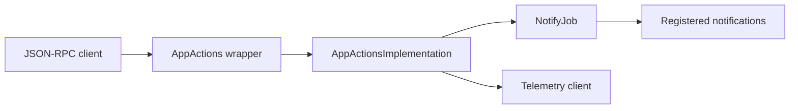
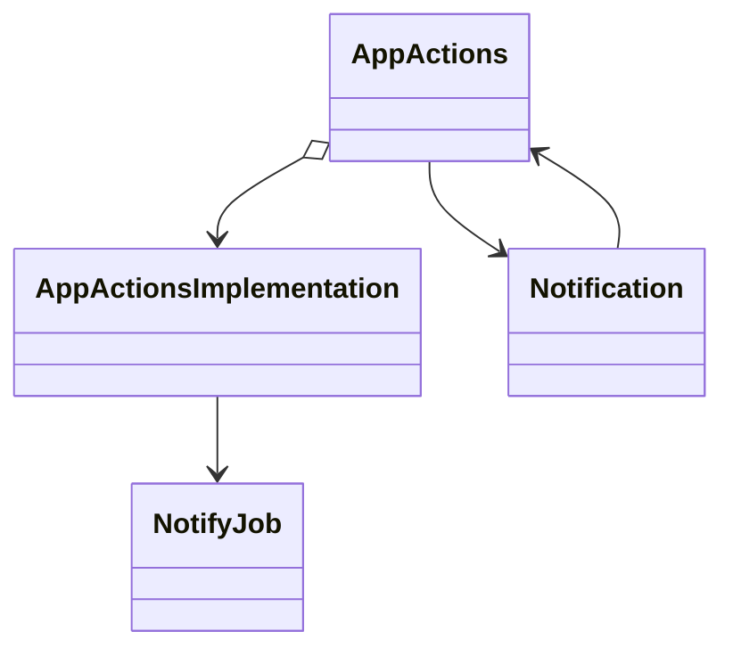
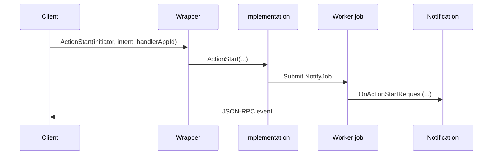
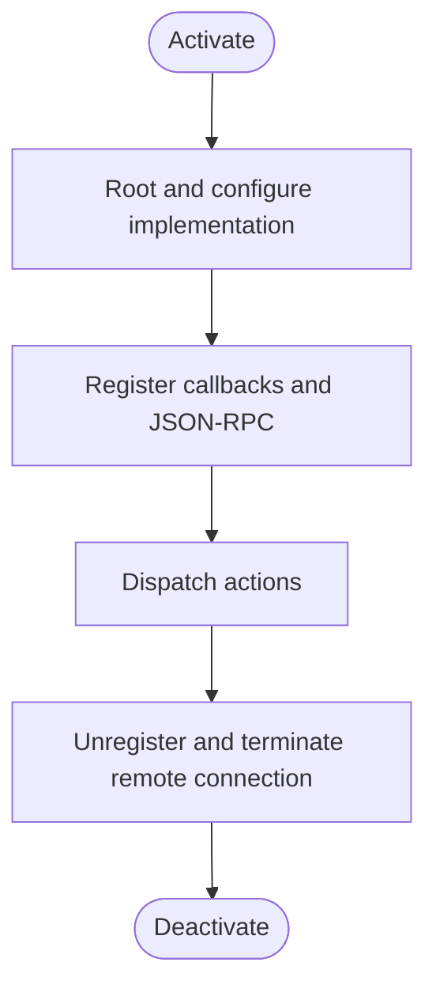

# AppActions Subsystem

## 1. High-Level Purpose & Architecture

`AppActions` provides app-to-app action/intent dispatch in the ENT/RDK Thunder environment. A public plugin wrapper exposes JSON-RPC while `AppActionsImplementation` owns notification registration and asynchronous action delivery.

Responsibilities:
- Register `org.rdk.AppActions` and expose generated `JAppActions` JSON-RPC methods.
- Accept `ActionStart(initiator, intent, handlerAppId)` requests.
- Deliver `OnActionStartRequest` callbacks asynchronously to registered consumers.
- Configure telemetry through the App Gateway telemetry helper.
- Handle out-of-process implementation failure notifications.

It does not select an application, implement application launch policy, or provide a WebSocket transport.

## 2. Architectural Overview

The wrapper uses `IShell::Root<Exchange::IAppActions>` to connect to `AppActionsImplementation`. The implementation stores callback references behind `mAdminLock`; `NotifyJob` moves dispatch to the worker pool.

```text
JSON-RPC client
      |
      v
 AppActions wrapper
      | Root / JAppActions
      v
AppActionsImplementation -- NotifyJob --> IAppActions::INotification clients
      |
      +--> AppGateway telemetry helper
```

## 3. Code Organization (Folder & File-Level)

- `AppActions/AppActions.h`: wrapper plugin, remote notification class, interface map, and lifecycle members.
- `AppActions/AppActions.cpp`: service registration, implementation root/configuration, JSON-RPC register/unregister, OOP cleanup.
- `AppActions/AppActionsImplementation.h`: implementation interfaces, callback list, lock, and `NotifyJob`.
- `AppActions/AppActionsImplementation.cpp`: action dispatch, registration, configuration, telemetry, and teardown.
- `AppActions/AppActions.conf.in`: platform precondition, callsign, autostart/startup order, and implementation locator template.
- `AppActions/CMakeLists.txt`: builds wrapper and implementation shared libraries.
- `AppActions/tests/README.md`: unit/integration test notes.

## 4. Class & Interface Documentation

### `Plugin::AppActions`

Implements `IPlugin` and `JSONRPC`, aggregates `Exchange::IAppActions`, and owns shell, connection ID, implementation, configuration interface, and `Notification`. `Notification` implements both `IAppActions::INotification` and `RPC::IRemoteConnection::INotification`; it forwards action events to generated JSON-RPC notifications and reports remote deactivation.

Actual interface map excerpt from [`AppActions.h`](../AppActions/AppActions.h):

```cpp
INTERFACE_ENTRY(PluginHost::IPlugin)
INTERFACE_ENTRY(PluginHost::IDispatcher)
INTERFACE_AGGREGATE(Exchange::IAppActions, mAppActions)
```

### `AppActionsImplementation`

Implements `IPlugin`, `IAppActions`, and `IConfiguration`. `ActionStart` submits `NotifyJob`; `Register` AddRefs and stores unique callbacks; `Unregister` releases and removes them; `DispatchActionStartRequest` snapshots/AddRefs callbacks before invoking them outside the lock.

### `NotifyJob`

A `Core::IDispatch` job containing initiator, intent, and handler app ID. It AddRefs its parent on construction and releases it on destruction, preventing the implementation from disappearing before asynchronous delivery.

## 5. Configuration & Build Integration

`AppActions.conf.in` declares `org.rdk.AppActions`, `precondition = ["Platform"]`, generated autostart/startup order, `mode`, and `locator = "lib@PLUGIN_IMPLEMENTATION@.so"`. CMake sets version `1.0.0`, builds `${NAMESPACE}AppActions` and `${NAMESPACE}AppActionsImplementation`, uses C++11, links Thunder plugins/definitions and `uuid`, and installs both libraries.

The implementation uses `-Wall -Werror` and `-Wl,-z,defs`. The root build flag is `PLUGIN_APPACTIONS`; telemetry helper behavior depends on the root telemetry option.

## 6. Internal Workflows & Execution Flow

- **Startup:** wrapper AddRefs shell, registers COM-link notification when available, roots `AppActionsImplementation`, obtains `IConfiguration`, configures it, registers implementation notifications, and registers `JAppActions`.
- **Action write:** caller invokes `ActionStart`; implementation enqueues `NotifyJob`; the worker invokes every registered callback.
- **Event read:** wrapper notification forwards callback data through `JAppActions::Event::OnActionStartRequest`.
- **Failure:** remote deactivation schedules a Thunder `DEACTIVATED/FAILURE` job when connection IDs match.
- **Shutdown:** unregister COM-link and implementation listeners, terminate remote connection, unregister JSON-RPC, release interfaces and shell, and reset connection ID.

## 7. Diagrams & Visual Aids

### Architecture



### Class



### Read/write sequence



### Lifecycle activity



## 8. Testing & Quality Analysis

L0 tests cover implementation, `ActionStart`, notifications, and init/deinit under `Tests/L0Tests/AppActions`. L1 coverage is `Tests/L1Tests/AppActions/AppActions_test.cpp`. The plugin also has test notes under `AppActions/tests/README.md`.

Recommended additions include callback ordering/duplicate registration tests, callback removal during dispatch, COM-link absence and remote crash scenarios, and telemetry failure isolation. Full application-launch behavior is outside this repository.

## 9. Beginner-to-Expert Teaching Mode

**Must know first:** the wrapper is the public Thunder/JSON-RPC surface; the implementation is the callback broker; worker jobs prevent the caller from being blocked.

**Advanced path:** study COM interface maps, AddRef/Release ownership, snapshotting callbacks before external calls, OOP connection notifications, and generated JSON-RPC event stubs.

**Known limits:** action routing after notification delivery is not implemented in these files; consumers decide how to handle the action.
