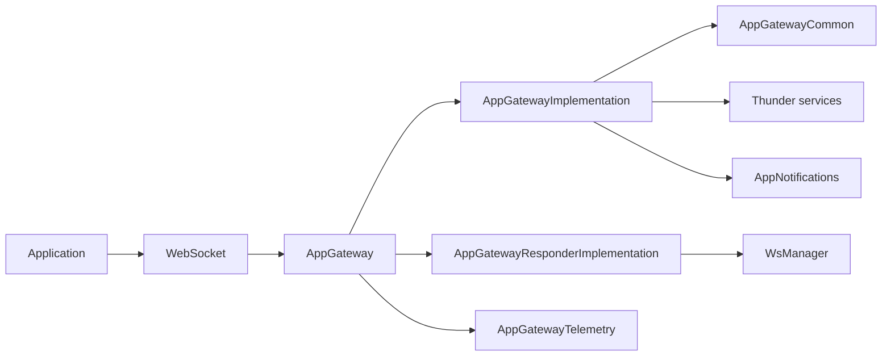
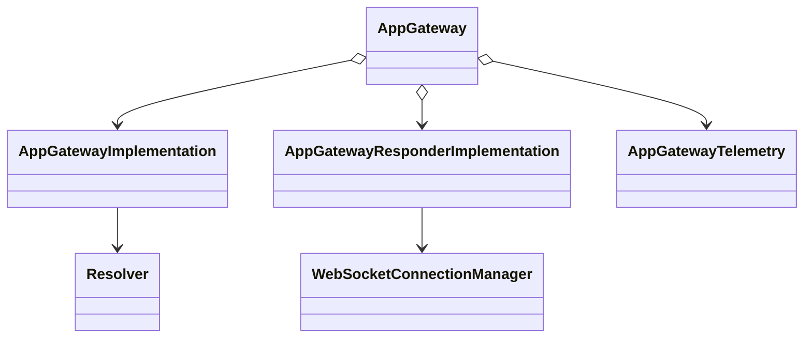
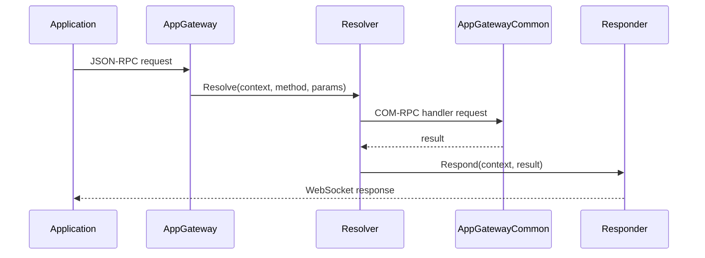
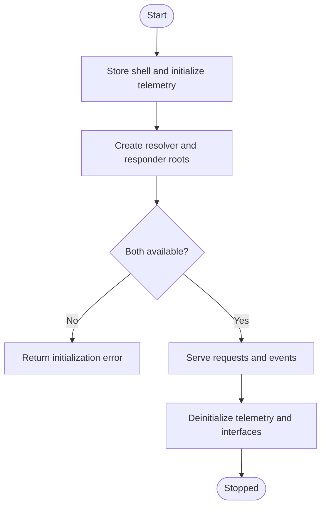

# AppGateway Subsystem

## 1. High-Level Purpose & Architecture

`AppGateway` is the Firebolt-facing ingress and egress plugin for the ENT/RDK Thunder environment. It exposes JSON-RPC resolver operations and coordinates WebSocket traffic between applications and Thunder services.

Responsibilities:
- Own the `org.rdk.AppGateway` Thunder lifecycle and JSON-RPC dispatcher.
- Load resolution aliases and route requests to COM-RPC handlers or Thunder JSON-RPC paths.
- Manage WebSocket request/response and event delivery through the responder implementation.
- Aggregate App Gateway telemetry and expose `Exchange::IAppGatewayTelemetry`.
- Preserve gateway context such as application, connection, request, origin, and version information.

It does not implement device settings, authentication policy, or every Firebolt API itself; those responsibilities are delegated primarily to `AppGatewayCommon`, `AppNotifications`, Thunder services, and launch delegates.

## 2. Architectural Overview

Major components are `AppGateway`, `AppGatewayImplementation`, `AppGatewayResponderImplementation`, `Resolver`, `AppGatewayTelemetry`, and the shared `WsManager`/context helpers. `AppGateway` obtains the two implementation objects with `IShell::Root()` and exposes their interfaces through its interface map.

```text
Application WebSocket
        |
        v
 AppGateway JSON-RPC shell
   | resolver       | responder
   v                v
Resolver ------> AppGatewayCommon / Thunder plugins
   |                |
   +----------> AppNotifications / launch delegate
        |
        v
 AppGatewayTelemetry -> T2 telemetry
```

## 3. Code Organization (Folder & File-Level)

- `AppGateway/AppGateway.h`: public Thunder plugin class; aggregates resolver, responder, and telemetry interfaces.
- `AppGateway/AppGateway.cpp`: service registration, initialization, COM-RPC roots, JSON-RPC stub registration, and teardown.
- `AppGateway/AppGatewayImplementation.h/.cpp`: resolver implementation, request routing, context updates, event hooks, and asynchronous response jobs.
- `AppGateway/AppGatewayResponderImplementation.h/.cpp`: WebSocket manager integration, request/response/event operations, connection context registries, and responder notifications.
- `AppGateway/Resolver.h/.cpp`: JSON resolution-file model, alias parsing, feature flags, and Thunder call selection.
- `AppGateway/AppGatewayTelemetry.h/.cpp`: telemetry singleton, counters, metric aggregation, cache/flush behavior, and T2 reporting.
- `AppGateway/resolutions/resolution.base.json`: installed resolution data loaded by the resolver.
- `AppGateway/AppGateway.conf.in`: generated Thunder configuration; declares `org.rdk.AppGateway` and the platform precondition.
- `AppGateway/CMakeLists.txt`: builds the single shared plugin and installs the resolution file.

The implementation depends on `interfaces/IAppGateway.h`, `IConfiguration.h`, `IAppNotifications.h`, `ContextUtils.h`, `WsManager.h`, and Thunder core/plugin libraries.

## 4. Class & Interface Documentation

### `Plugin::AppGateway`

Implements `PluginHost::IPlugin` and `PluginHost::JSONRPC`; aggregates `IAppGatewayResolver`, `IAppGatewayResponder`, and `IAppGatewayTelemetry`. Members include `mService`, the three interface pointers, and `mConnectionId`. `Initialize()` keeps a shell reference, initializes telemetry, creates resolver/responder roots, configures them, and registers the generated resolver JSON-RPC stub. `Deinitialize()` unregisters/releases interfaces, terminates the remote connection, and releases the shell.

Actual interface map excerpt from [`AppGateway.h`](../AppGateway/AppGateway.h):

```cpp
BEGIN_INTERFACE_MAP(AppGateway)
INTERFACE_ENTRY(PluginHost::IPlugin)
INTERFACE_ENTRY(PluginHost::IDispatcher)
INTERFACE_AGGREGATE(Exchange::IAppGatewayResolver, mAppGateway)
INTERFACE_AGGREGATE(Exchange::IAppGatewayResponder, mResponder)
INTERFACE_AGGREGATE(Exchange::IAppGatewayTelemetry, mTelemetry)
END_INTERFACE_MAP
```

### `AppGatewayImplementation`

Implements `IAppGatewayResolver` and `IConfiguration`. `Resolve()` is the main request entry; `ResolverPtr` supplies alias metadata, while `RespondJob` and `EventHookJob` keep asynchronous work alive with reference counting. It caches responder/notification interfaces behind critical-section locks.

### `AppGatewayResponderImplementation`

Implements `IAppGatewayResponder` and `IConfiguration`. `Respond`, `Emit`, and `Request` use `WebSocketConnectionManager`; `AppIdRegistry`, `DebugDisabledConnectionsRegistry`, and `CompliantJsonRpcRegistry` retain per-connection policy/context state. `WsMsgJob`, `RespondJob`, `EmitJob`, and `RequestJob` move socket work to the worker pool.

### `Resolver`

Owns a mutex-protected map of `Resolution` records. Each record contains alias, event, event hook, permission group, additional context, and COM-RPC/version flags. It provides `LoadConfig`, `ResolveAlias`, `HasEvent`, `HasEventHook`, and `CallThunderPlugin`.

### `AppGatewayTelemetry`

Singleton implementation of `IAppGatewayTelemetry`. It records events and metrics, health counters, API/service errors, bootstrap time, and periodic or threshold-triggered flushes. The header defines defaults of 3,600 seconds and 1,000 cached records.

## 5. Configuration & Build Integration

`AppGateway.conf.in` sets `precondition = ["Platform"]`, callsign `org.rdk.AppGateway`, and generated autostart/startup order values. The current template does not show a generated `mode` or `locator`; the plugin is built as `${NAMESPACE}AppGateway` and installed under `lib/${STORAGE_DIRECTORY}/plugins`.

`CMakeLists.txt` uses C++11, `${NAMESPACE}Plugins`, `${NAMESPACE}Definitions`, and `CompileSettingsDebug`. Optional definitions include `BUILD_CONFIG_PATH`, `VENDOR_CONFIG_PATH`, `ENABLE_APP_GATEWAY_AUTOMATION`, `AUTOMATION_APP_ID`, and `APP_GATEWAY_ENHANCED_LOGGING_INDICATOR`. `BUILD_ENABLE_TELEMETRY_LOGGING` adds `telemetry_msgsender`.

## 6. Internal Workflows & Execution Flow

- **Startup:** `AppGateway::Initialize()` stores the shell, starts telemetry, roots resolver/responder implementations, configures them, registers JSON-RPC, and records bootstrap duration.
- **Read/request:** JSON-RPC reaches resolver `Resolve()`, which parses resolution metadata, checks context/permissions/event behavior, and either invokes a COM-RPC handler or schedules a response through the responder.
- **Write/response:** responder jobs call `ReturnMessageInSocket`; `Emit` sends event payloads to a connection; `Request` sends a gateway request to an application.
- **Event flow:** resolution metadata can trigger `AppNotifications` subscription and an event hook routed back to a handler.
- **Flush:** telemetry aggregates metrics and flushes immediately for selected events or by reporting interval/cache threshold.
- **Shutdown:** telemetry is deinitialized first, generated stubs and roots are released, remote connections are terminated, and the shell reference is released.
- **Errors:** missing roots return a non-empty initialization message; unavailable responders and failed calls use framework error codes and logging.

## 7. Diagrams & Visual Aids

### Architecture



### Class



### Read/write sequence



### Lifecycle activity



## 8. Testing & Quality Analysis

Existing coverage includes L0 tests for initialization, JSON-RPC resolve, resolver branches, responder behavior, context conversion, and telemetry; L1 tests include `Tests/L1Tests/tests/test_AppGateway.cpp`; L2 coverage includes `Tests/L2Tests/tests/AppGateway_L2Test.cpp`. `AppGateway/tests/CurlCmds.md` provides smoke-test commands.

Recommended additions are real resolution-file matrix tests, concurrent connection/context lifecycle tests, malformed WebSocket payload tests, and end-to-end telemetry flush verification. The source does not expose a complete runtime deployment topology or the generated `IAppGateway` interface definitions in this repository, so exact external RPC schemas must be read from the installed Thunder interface package.

## 9. Beginner-to-Expert Teaching Mode

**Must know first:** Thunder plugins implement `IPlugin`; `JSONRPC` supplies dispatcher behavior; `IShell::Root()` obtains COM-RPC implementations; a resolver chooses what a request means; a responder sends it back to the socket.

**Advanced path:** study `Resolver` alias metadata, `GatewayContext` propagation, worker-pool job lifetime/ref-counting, connection registries, COM-RPC failure handling, and `AppGatewayTelemetry` aggregation/flush semantics. Then trace one event from `AppNotifications` through `Emit` to a WebSocket client.

**Known limits:** exact behavior of helpers and generated interface methods depends on files outside this subsystem, especially the external Thunder `interfaces` package.
