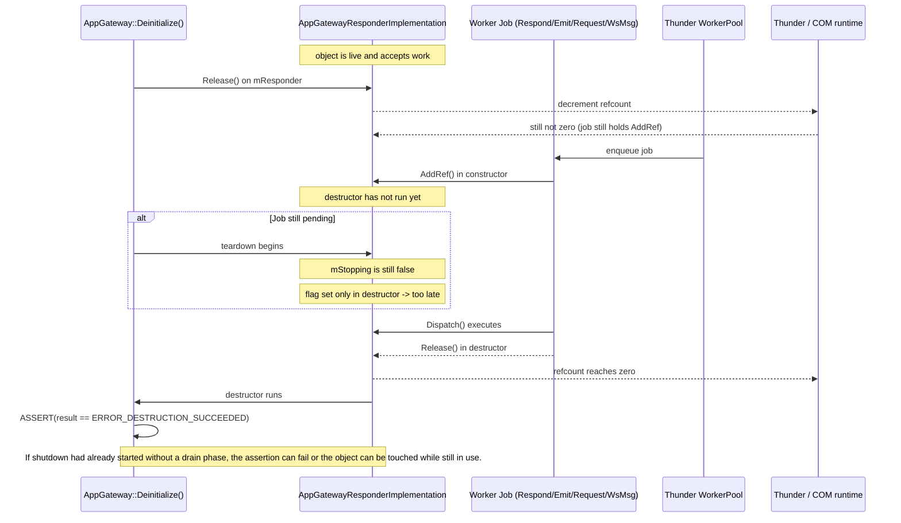

# AppGateway responder shutdown issue

## Summary

The bug is not just “a stale flag.” The real problem is timing.

`AppGatewayResponderImplementation` submits worker jobs that keep the implementation alive by calling `AddRef()` in the job constructor and `Release()` in the job destructor:

```cpp
RefCountedDispatchJob(TParent* parent)
    : mParent(*parent)
{
    mParent.AddRef();
}

~RefCountedDispatchJob() override
{
    mParent.Release();
}
```

That means a queued or executing job can keep the responder object alive even after the plugin lifecycle is already entering shutdown. If shutdown only flips a flag in the destructor, that flag is set too late to stop the race.

## Why the destructor flag is too late

`mStopping` is written only in the destructor:

```cpp
AppGatewayResponderImplementation::~AppGatewayResponderImplementation()
{
    mStopping.store(true, std::memory_order_release);
}
```

But the destructor cannot run until the object’s COM refcount reaches zero. A pending worker job is itself holding a reference, so the object cannot reach zero while the job still exists. This creates a deadlock in the lifecycle logic:

- shutdown calls `Release()` on the responder,
- refcount does not hit zero because a job still owns an `AddRef()`,
- destructor never sets `mStopping`,
- new work is not stopped in time,
- the object may still be touched while teardown is already underway.

This is exactly why the drain/stop phase must happen before the final COM release.

## Why Thunder R4.4 matters

Thunder handles many lifecycle details internally, especially for COM-RPC and OOP plugin hosting, but it does not automatically know that this plugin created worker jobs which keep the implementation alive with manual refcounting.

So the framework can help with:

- COM object lifetime tracking,
- OOP process supervision,
- remote connection termination,
- `ERROR_DESTRUCTION_SUCCEEDED` semantics for final release.

But it cannot infer that this plugin needs an explicit shutdown barrier for in-flight jobs. That must be implemented in the plugin code itself.

## Flow diagram



## Correct lifecycle pattern

The safe pattern is:

1. stop accepting new work,
2. wait for all already submitted jobs to finish,
3. only then release the final COM ref.

This is the same pattern already used by robust code elsewhere in the repo: stop the source of new jobs, wait for the active-job counter to reach zero, then destroy/release the owned object.

## Key takeaway

The shutdown guard being written only in the destructor is a lifecycle ordering bug. The object must be marked as stopping before the final release path begins, and all queued worker jobs must be drained before `Release()` is allowed to reach the final destruction boundary.

What the proposed solution is
The intended solution is essentially:

Set a shutdown/stopping flag before teardown begins.
Reject or skip new Respond / Emit / Request / WS jobs once stopping starts.
Track an active worker-job counter.
Increment it before queueing each job.
Decrement it when the job finishes.
Block until the counter reaches zero before releasing the responder object.
In other words, the lifecycle should be:

stop admission
drain outstanding work
release final COM ref
not:

release COM ref
destructor finally sets stop flag
hope jobs are gone
