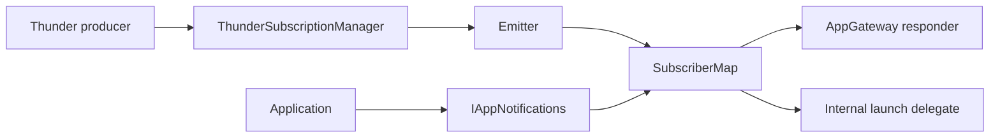
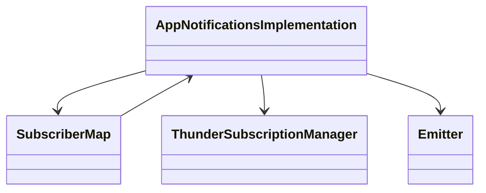
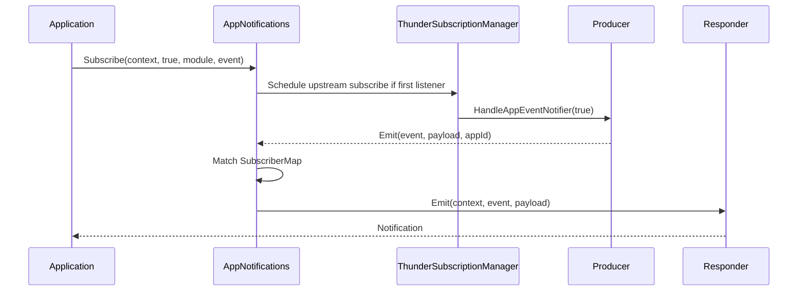
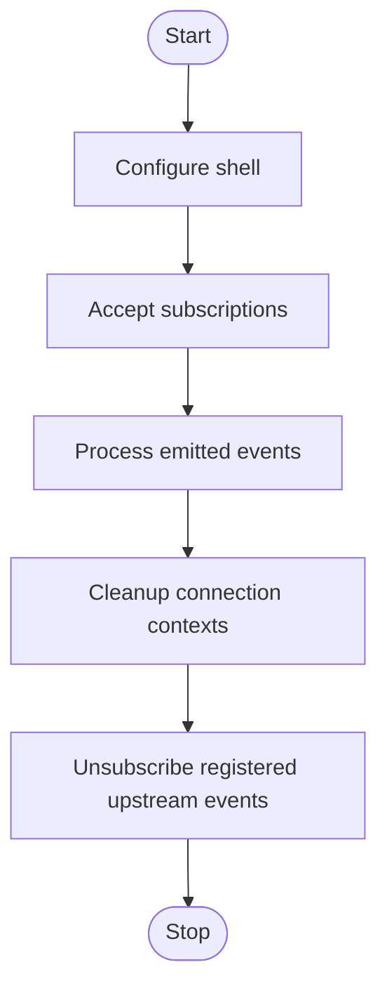

# AppNotifications Subsystem

## 1. High-Level Purpose & Architecture

`AppNotifications` is the event subscription and routing subsystem. It lets application contexts subscribe to events emitted by Thunder plugins, maintains subscriber context, and forwards matching payloads either to the external AppGateway or an internal launch delegate.

Responsibilities:
- Expose `IAppNotifications` through a Thunder plugin shell and JSON-RPC dispatcher.
- Maintain case-normalized event subscriptions and connection cleanup.
- Subscribe once to an upstream `IAppNotificationHandler` when the first app listener appears.
- Fan out emitted events to matching application contexts, filtered by app ID when present.
- Route gateway-origin and non-gateway-origin events to the appropriate responder.

It does not own WebSocket transport, implement platform event producers, or resolve Firebolt API methods.

## 2. Architectural Overview

The shell plugin roots `AppNotificationsImplementation`. The implementation contains `SubscriberMap` for app contexts, `ThunderSubscriptionManager` for upstream subscriptions, and an `Emitter` callback used by upstream handlers.

```text
Thunder producer
      |
      v
IAppNotificationHandler <- ThunderSubscriptionManager
      |
      v Emitter / EmitJob
SubscriberMap <- app Subscribe/Emit/Cleanup
      |                         |
      v                         v
AppGatewayResponder     InternalGatewayResponder
```

## 3. Code Organization (Folder & File-Level)

- `AppNotifications/AppNotifications.h`: outer Thunder plugin and aggregated `IAppNotifications` pointer.
- `AppNotifications/AppNotifications.cpp`: outer lifecycle, service registration, root implementation acquisition, and JSON-RPC registration.
- `AppNotifications/AppNotificationsImplementation.h`: interfaces plus `SubscriberMap`, `ThunderSubscriptionManager`, `SubscriberJob`, `EmitJob`, and `Emitter`.
- `AppNotifications/AppNotificationsImplementation.cpp`: subscription, emission, cleanup, dispatch, upstream notifier calls, and configuration.
- `AppNotifications/AppNotifications.conf.in`: callsign/precondition/autostart/startup order.
- `CMakeLists.txt`: builds the outer and implementation code into one shared plugin target.
- `tests/CurlCmds.md`: smoke-test commands.

Dependencies include `IAppGateway.h`, `IAppNotifications.h`, `IConfiguration.h`, `ContextUtils.h`, `UtilsCallsign.h`, and `UtilsController.h`.

## 4. Class & Interface Documentation

### `Plugin::AppNotifications`

Implements `IPlugin` and `JSONRPC`, aggregates `IAppNotifications`, and owns `mService`, `mAppNotifications`, and `mConnectionId`. It provides the framework lifecycle while the implementation owns event state.

### `AppNotificationsImplementation`

Implements `IAppNotifications` and `IConfiguration`. `Subscribe` updates the map and schedules upstream subscription changes; `Emit` schedules an event update; `Cleanup` removes contexts by connection and origin. `mShell`, `mSubMap`, `mThunderManager`, and `mEmitter` are the principal members.

### `SubscriberMap`

Stores `map<string, vector<AppNotificationContext>>` under a mutex. `Add`, `Remove`, `Get`, and `Exists` manage subscriptions; `EventUpdate` filters and dispatches; `CleanupNotifications` removes disconnected contexts. It lazily obtains gateway responder interfaces.

Actual excerpt from [`AppNotificationsImplementation.h`](../AppNotifications/AppNotificationsImplementation.h):

```cpp
void EventUpdate(const string& key, const string& payloadStr, const string& appId);
void CleanupNotifications(const uint32_t &connectionId, const string& origin);
```

### `ThunderSubscriptionManager`

Tracks `(module,event)` registrations and calls an upstream `IAppNotificationHandler` through `HandleNotifier`. Its destructor copies and unsubscribes registered notifications outside the mutex.

### `Emitter`, `SubscriberJob`, and `EmitJob`

`Emitter` converts upstream callbacks into worker-pool `EmitJob`s. `SubscriberJob` performs subscribe/unsubscribe asynchronously. The jobs hold their parent by reference through the proxy object and execute outside the caller's path.

## 5. Configuration & Build Integration

`AppNotifications.conf.in` declares `org.rdk.AppNotifications`, `precondition = ["Platform"]`, and generated autostart/startup order. It has no explicit mode or locator in the checked-in template.

CMake sets version `1.0.0`, C++11, `MODULE_NAME=Plugin_AppNotifications`, `${NAMESPACE}Plugins`, `${NAMESPACE}Definitions`, `CompileSettingsDebug`, `-Wl,-z,defs`, and `-Wall -Werror`. The target installs to `lib/${STORAGE_DIRECTORY}/plugins`.

## 6. Internal Workflows & Execution Flow

- **Subscribe:** if the event has no subscriber, schedule upstream subscribe; then add the context. Unsubscribe removes the context and schedules upstream unsubscribe when the event becomes empty.
- **Emit:** enqueue `EmitJob`; `EventUpdate` lowercases the lookup key, applies app-ID filtering, and dispatches each matching context.
- **Gateway delivery:** gateway-origin contexts are converted with `ContextUtils` and sent through `IAppGatewayResponder::Emit`.
- **Delegate delivery:** other origins use the internal gateway responder.
- **Cleanup:** remove all contexts matching connection ID and origin; empty event entries disappear.
- **Shutdown/errors:** manager destructor unsubscribes upstream entries; missing handlers/responder interfaces are logged and treated as unavailable.

## 7. Diagrams & Visual Aids

### Architecture



### Class



### Read/write sequence



### Lifecycle activity



## 8. Testing & Quality Analysis

L0 coverage includes initialization/deinitialization, context equality, subscription, emission, subscriber map, Thunder manager, and boundary tests under `Tests/L0Tests/AppNotifications`. L1 coverage is in `Tests/L1Tests/tests/test_AppNotifications.cpp`; `AppNotifications/tests/CurlCmds.md` provides smoke tests.

Recommended additions include concurrent subscribe/emit/cleanup stress, upstream producer deactivation/re-activation, duplicate subscription semantics, and responder failure tests. Exact behavior of external producers is not visible in this repository.

## 9. Beginner-to-Expert Teaching Mode

**Must know first:** a subscription is stored locally, but the actual producer subscription is shared per module/event; events are later fanned out to many app contexts.

**Advanced path:** study normalized keys, app-ID filtering, context conversion, mutex boundaries around COM-RPC, worker-pool jobs, and teardown ordering. Then trace producer callbacks through `Emitter` and both responder paths.

**Known limits:** generated `IAppNotifications` definitions and producer implementations are external to this source tree.
